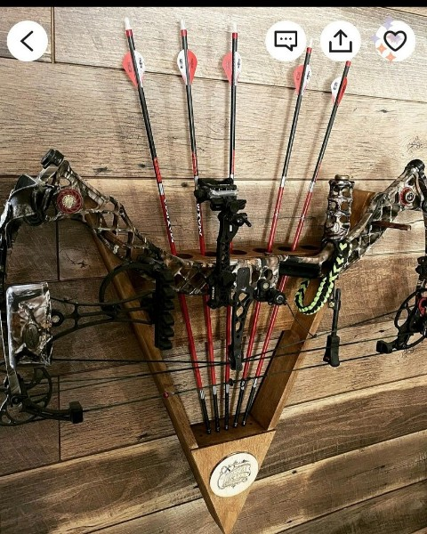
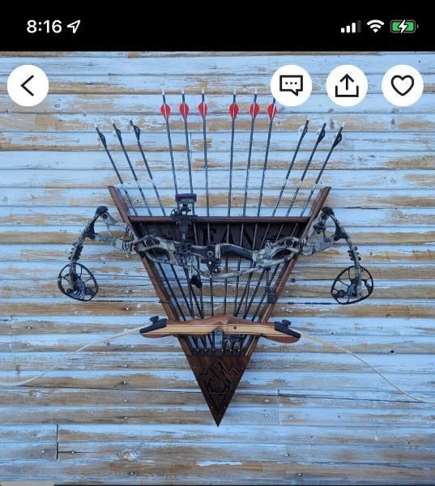
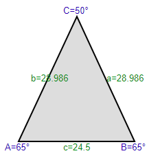
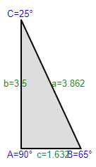
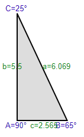

# Bow Holder

Inspiration:

Materials:

* 1 - 1x4x10 oak
* 1 - 0.3125 x 36" oak round dowel
* 1 - 1x4x12 douglas fir tongue and groove board - (availability is extremely limited. Might need to find alternatives - which adjusts cost and dimensions)
* Box of 1" interior wood screws
* Wood glue
* Clear Matte Spray

Approximate Material Cost: $78

Cost Breakdown:
* lumber - $65.10
* hardware - $6.98
* paint - $5.98

Calculations:

* Most of the angles here are 25 degrees

* The tongue and groove section should have the following dimensions

    

    And here is the part that is cut off each new row:

    

    At a total height of 26.27", we will need 8 rows of tongue and groove, each row will cut off 3.264"

    * Row 1 - 24.5"
    * Row 2 - 21.236"
    * Row 3 - 17.972"
    * Row 4 - 14.708"
    * Row 5 - 11.444"
    * Row 6 - 8.18"
    * Row 7 - 4.916"
    * Row 8 - 1.652"

    Total Length: 104.608"

    

    If using 6" tongue and groove - we will need 5 rows of tongue and groove, each row will cut off 5.129"

    * Row 1 - 24.5"
    * Row 2 - 19.371"
    * Row 3 - 14.241"
    * Row 4 - 9.112"
    * Row 5 - 3.982"

    Total Length: 71.206"
